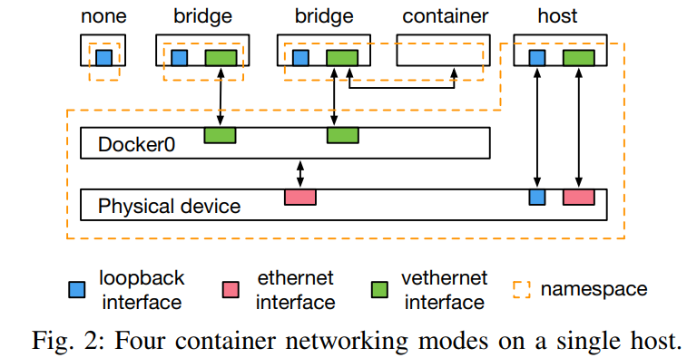
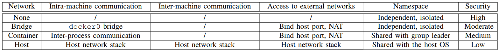
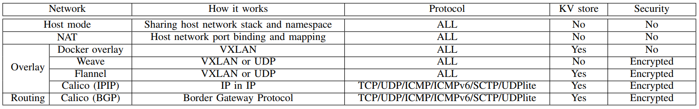

# Contributions？

> Three finding 

* 在单个主机上的容器网络中，**性能和安全隔离是一个困难的权衡**.通过共享相同的网络名称空间可以获得良好的性能，而通过使用隔离的名称空间可以加强安全性
* 多主机容器网络在选择网络方案时面临困难的权衡。
  * overlay 网络包处理带来较大开销；但在网络管理上更加灵活安全
  * NAT网络性能高，但安全性低
  * 路由网路性能高但需要额外的设备支持（BGP）
* 虚拟化会带来吞吐率下降和延迟增加。容器网络和虚拟机网络之间复杂的交互
* 集装箱网络在启动时间上有一个数量级的差异。在选择容器网络时，短时间且对延迟敏感的工作负载应该考虑启动时间

# Why Container?

* VMs limitations：
  * VM成熟的操作系统占用了大量内存空间，限制了可以整合到单个物理机的VM数量
  * OS启动时间长，不利于部署生命周期短的应用
* Container advantages：
  * 整合率高，即单个机器的容器密度高
  * 启动时间短，适用于部署事务驱动的微服务，现实场景中很多容器的生命周期都很短

# Challenge？

> 在动态云环境中为**大量短期**使用的容器提供网络连接

* 操作系统级虚拟化的灵活性允许容器以多种方式将连接到外部网络（**需要根据隔离性、安全性、性能的要求弹性选择网络**）
* 由于单个服务器上的容器密度很高，因此为了保证性能，在扩展大量链接的同时，也要求单个链接对网络性能的影响降到最小
* 在建立容器间连接之前，容器不能使用（**网络连接建立时延会削弱容器启动快的优势**，例如事务触发的无服务器代码）

* 容器的安全隔离性低于虚拟机

# Solution？

## single host network

> Through shared memory

* Node mode

* bridge mode

* container mode

* host mode

  
  
  

## multi host network

> providing IP addressing

* host mode
* NAT
  * 方案：container IP address = host IP + port num
  * 每个包都需要地址转换，会导致性能下降
  * 在由生命周期短的容器组成的动态网络中，端口冲突是个问题（**安全性**）
* overlay network
  * 方案：容器将其私有IP地址和主机IP之间的映射保存在键-值(KV)存储中，所有主机都可以访问该存储，**将容器IP和其物理位置解耦**
  * 包处理过程、改变 数据包大小
* routing
  * 方案：它在主机内核中实现了一个虚拟路由器并使用用于分组路由的BGP
  * 支持网络协议有限
  * BGP在大部分网络中心未被支持
  * 路由表的大小限制了容器网络的规模

# Experiment？

> 影响因子

## packet size

* 对overlay**网络数据包越大封装时间越长**

## network protocol

## impact of virtualization

## interference

## CPU overhead

## scalability

## network launch time

